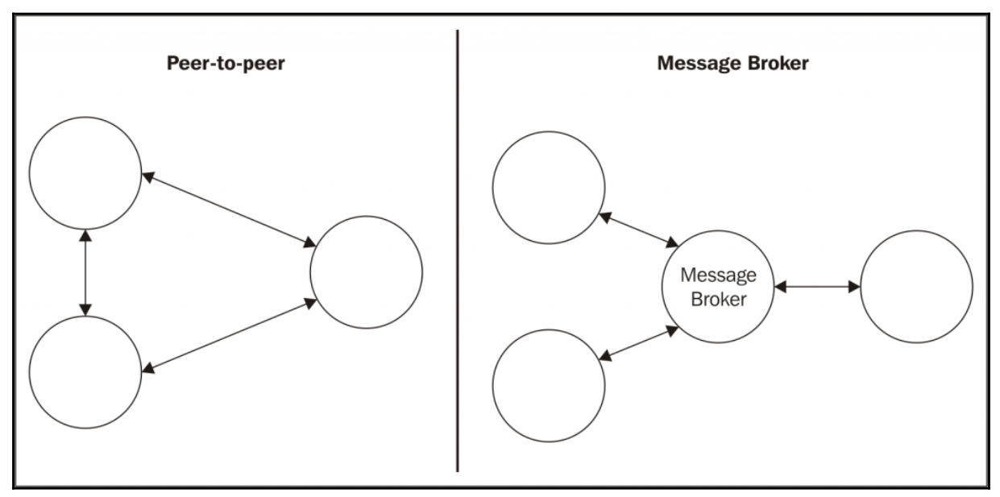

# Asynchronous integration via Kafka

- The fundamentals of a messaging system
- The `publish/subscribe` pattern
- Pipelines and task distribution patterns
- `Request/reply` patterns

Message types
- Command Message
- Event Message
- Document Message

`Peer-to-peer` vs `Message broker`

**Websockets**
- Node.js websocket library used `ws`. See the application [chatapp-socket](chatapp-socket/index.js)

**Message Brokers**
- Rabbit MQ
- Apache Kafka

