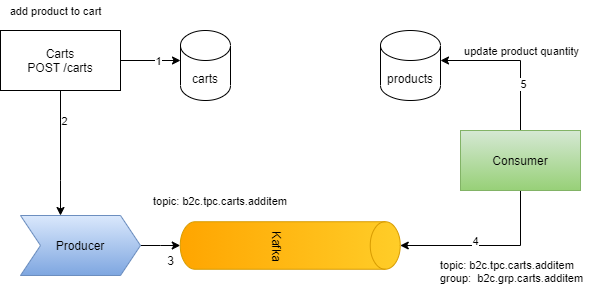

# Kafka events in Nodejs

This chapter is to implement the scaling applications using Kafka message broker as the main communication

Prerequisites
- MongoDB: to install [`mongodb`](https://github.com/lqtruong/mongo-docker) using docker
- [`Kafka + Zookeeper`](https://github.com/lqtruong/kafka-docker) using docker

Steps 
- to install `@hapi/hapi`
- to install [`mongodb`](https://github.com/lqtruong/mongo-docker) using docker 
- to install connector to mongodb (in this example, we try to use `mongodb` using [`mongoose`](https://github.com/Automattic/mongoose) instead of `sqlite3`)
- to install `kafkajs` as client side to produce & consume messages

# Scenario + Architecture

Below is the diagram for B2C `carts` & `products` domain interaction via `Kafka`



# Start HAPI server
# Router

| Verb | Path | Handler | Purpose |
|---|---|---|---|
| GET | `/` | return `Hello` welcome | Home page |
| GET | `/carts/{userId}` | Carts.getAllByUser | get all current items in cart for specific user |
| POST | `/carts` | Carts.addItem | add product to cart |
| DELETE | `/carts/{productId}` | Carts.deleteItem | delete product from cart |
| GET | `/products?page=n&size=m` | Products.getAll | get all products in store, pageable |
| GET | `/products/{id}` | Products.getById | get product by id |
| POST | `/products` | Products.addProduct | add product to system |
| DELETE | `/products/{id}` | Products.deleteById | delete product by id |

# Handlers

# Producer

```
const { Kafka } = require('kafkajs')

const kafkaBootstrapServer = new Kafka({
    clientId: 'b2c',
    brokers: ['localhost:9092']
})

const initProducer = async () => {
    const producer = kafkaBootstrapServer.producer();
    await producer.connect();
    return producer;
}


const addProductToCartEvent = async (product) => {
    // console.log(product);
    initProducer()
        .then(producer => {
            console.log('Producer connected');
            if (product) {
                producer.send({
                    topic: 'b2c.tpc.carts.additem',
                    messages: [
                        {
                            value: JSON.stringify(product)
                        }
                    ],
                });
            }
        })
        .catch(err => console.log(err));
};

addProductToCartEvent();
```
See more [producer from carts](events/carts_events.js)

# Consumer

```
const kafkaBootstrapServer = new Kafka({
    clientId: 'b2c',
    brokers: ['localhost:9092']
})

const initConsumer = async (options) => {
    const consumer = kafkaBootstrapServer.consumer({ groupId: options.groupId })
    await consumer.connect();
    return consumer;
}

const checkProductAvailabilityEvent = async () => {
    await initConsumer({ groupId: 'b2c.grp.carts.additem' })
        .then((consumer) => {
            consumer.subscribe({ topic: 'b2c.tpc.carts.additem', fromBeginning: true });
            consumer.run({
                eachMessage: async ({ topic, partition, message }) => {
                    console.log('received');
                    let data = JSON.parse(message.value.toString());
                    console.log(data);
                    let products = data.products;
                    if (products) {
                        products.forEach(prod => {
                            // check id & update quantity
                            Products.buyProduct(prod._id, prod.quantity)
                                .then(updatedProduct => sendBackProductAvailability(updatedProduct))
                                .catch(err => console.log(err));
                        });
                    }

                },
                autoCommitInterval: 200
            });
        })
        .catch(err => console.log(err));
};

const sendBackProductAvailability = async (product) => {
    const producer = kafkaBootstrapServer.producer();
    await producer.connect();
    producer.send({
        topic: 'b2c.tpc.carts.additem.availability',
        messages: [
            {
                value: JSON.stringify(product)
            }
        ],
    });

};

checkProductAvailabilityEvent();
```

See more [consumer from products](events/products_events.js)

# Test

- To start the app

```
cd kafka
node index.js
```
- add the product into system first

```
curl --location --request POST 'localhost:4000/products' \
--header 'Content-Type: application/json' \
--data-raw '{
    "name": "T-shirt",
    "quantity": 5,
    "price": 20.5
}'
```

- To add a product to the cart

```
curl --location --request POST 'localhost:4000/carts' \
--header 'Content-Type: application/json' \
--data-raw '{
    "userId": "607085305121d938c3cdfd91",
    "products": [
        {
            "_id": "60814d510d45345c64d7013f",
            "quantity": 1
        }
    ]
}'
```

- To check the quantity of product that remains in the system

```
curl --location --request GET 'localhost:4000/products/60814d510d45345c64d7013f'
```
