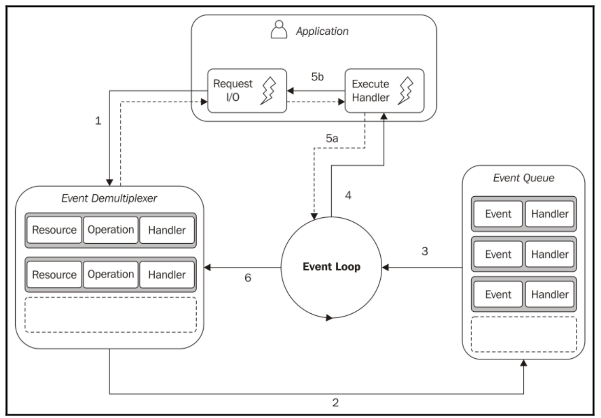
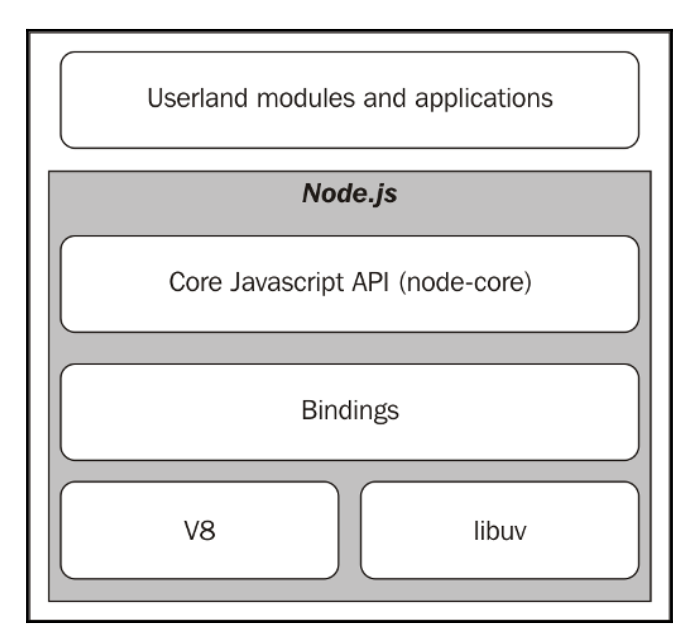

# Node's philosophy
- Node.js is a platform - not even a framework
- Approaching Node.js is in fact way more than simply learning a new technology

In Node.js, the principles come from 
- creator - Ryan Dahl
- contributors of the core
- community's charismatic figures
- JavaScript culture
- Unix philosophy

# Node.js principles
## small core
## small module in both code & scope

This increases the reusability of the package

- Easier to understand and use
- Simpler to test and maintain
- Perfect to share with the browser

**DRY** (aka. Don't Repeat Yourself) principle applied to the whole new level

## small surface area
This is to exposing a minimal set of functionalities

- In Node.js, modules are created to be used rather than extended

## simplicity and pragmatism
**KISS** (aka. Keep It Simple, Stupid) principle to use

- Simplicity is the most important consideration in a design - Richard P. Gabriel

**DO NOT**: trying to create nearperfect software with huge effort and tons of code to maintain.

**DO**: trying to get something working sooner and with reasonable complexity 

# ES2015 - ECMAScript 2015 specification or ES6
ECMAScript 2015 features work on Node.js version 6 by using **strict** mode. To enable this mode, we place the below statement at the begining of the script
```
use strict
```

Those below ES2015 features
## The let and const keywords

- historically, `var` declaration inside `if` can be accessed outside of the `if` statement. This causes bugs.
- ES2015 introduces `let` to declare the variables within defined scope.
- ES2015 introduces `const` keyword to declare the `constant variables` that never change
- In fact, in ES2015, `const` does not indicate that the assigned value will be constant, but that the `binding with the value` is constant
```
const path = require('path'); // best practices
// .. do stuff with the path module
let path = './some/path'; // this will fail
```
## The arrow function

```
const numbers = [2, 6, 7, 8, 1];
const even = numbers.filter(x => x%2 === 0);
```
With the arrow function, the variable with scope `this` will be fixed across class/OR file scope. Previously, the scope `this` will not be recognized within `callback function` writting.

Before
```
DelayedGreeter.prototype.greet = function() {
    setTimeout( (function cb() {
    console.log('Hello' + this.name); // this.name was NOT recognized within cb callback function scope
    }).bind(this), 500);
};
```

After
```
DelayedGreeter.prototype.greet = function() {
    setTimeout(() => console.log('Hello' + this.name), 500); // this.name is working well
};
```

See more [arrow_function.js](../../arrow_function.js)

## Class syntax
From ES2015, instead of using `prototype with helper function`, we can use `class syntax` with its function

```
class Person {
    constructor(name, surname, age) {
        this.name = name;
        this.surname = surname;
        this.age = age;
    }
    getFullName() {
        return this.name + ' ' + this.surname;
    }
    static older(person1, person2) {
        return (person1.age >= person2.age) ? person1 : person2;
    }
}
```

See more [class_syntax.js](../../class_syntax.js)

We can use `extends` keyword to extend the class

See more [class_extends.js](../../class_extends.js)

## Enhanced object literals
We can declare & assign the value to the object literals at the declaration time
```
const x = 22;
const y = 17;
const obj = { x, y };
```
This will implicitly assign the objec to {22, 17}, respectively.

The same applied for functions
```
module.exports = {
    square (x) {
        return x * x;
    },
    cube (x) {
        return x * x * x;
    }
};
```
We also can use `computed property` through the `set` and `get` syntax. 

See more [computed_property.js](../../computed_property.js)

## Map and Set collections
ES2015 introduces a new prototype called `Map`

See more [maps.js](../../maps.js)

Along with `Map`, ES2015 also introduces the `Set` prototype. This prototype allows us to easily construct sets, which means lists with `unique values`

See more [sets.js](../../sets.js)

## WeakMap and WeakSet collections
ES2015 also defines a `"weak"` version of the Map and the Set prototypes called `WeakMap` and `WeakSet`.

See more [weak_maps.js](../../weak_maps.js) and [weak_sets.js](../../weak_sets.js)

`WeakMap's` properties
- exposes the same interface of `Map`
- no way to iterate all over the entries
- it only allows having objects as keys

=> this enables the objects `as keys` will be able to be `garbage-collected` available

```
let obj = {};
const map = new WeakMap();
map.set(obj, {key: "some_value"});
console.log(map.get(obj)); // {key: "some_value"}
obj = undefined; // now obj and the associated data in the map will be cleaned up in the next gc cycle
```

The last line will make the object `obj` be available for gabage collector & its metadata in the `WeakMap` will be removed automatically.

`WeakSet` has the same `WeakMap`'s properties.

**Conclusion:** `WeakMap` and `WeakSet` are `not better or worse` than `Map` and `Set`, they are simply `more suitable` for different `use cases`.

## Template literals
ES2015 provides a very powerful syntax to define strings
- use back ticks (**`**) as delimiters
- can `interpolate` variables or expressions using `${expression}`

See more [template_literals.js](../../template_literals.js)

## Other ES2015 features
- Promise - Chapter 4
- Default function parameters
- Rest parameters
- Spread operator
- Destructuring
- new.target (we will talk about this in Chapter 2, Node.js Essential Patterns)
- Proxy (we will talk about this in Chapter 6, Design Patterns)
- Reflect
- Symbols

# Reactor pattern
This is the heart of the asynchronous nature of Node.js. Concepts behind
- single-threaded architecture
- the non-blocking I/O

Reasons
- I/O is slow
    - RAM - transfer rate ~ `GB/s`, while `disk and network` varies from `MB/s` to, optimistically, GB/s
    - I/O is usually not expensive in terms of CPU, but it adds a `delay` between the moment the request is sent and the moment the operation completes

- Blocking I/O
    - blocking I/O will `not` be able to handle multiple connections in the same thread
    - a thread has to `block` in order to `wait for the result` of an I/O operation

- Non-blocking I/O
    - the system call always `returns immediately` without waiting for the data to be read or written
    - basic pattern for accessing this kind of non-blocking I/O is to `actively poll` the resource within a loop until some actual data is returned; this is called `busy-waiting`
    - Polling algorithms usually result in a huge amount of wasted CPU time

- Event demultiplexing
    - event loop

Introduction of Reactor Pattern

The idea is to have a `handler` (which in Node.js is represented by a *callback* function) associated with `each I/O operation`



- the application generates an `I/O operation` by submitting request to `Event Demultiplexer`. The `Event Demultiplexer` specifies the corresponding `handler` that will executes `after` the operation completes
- when I/O operation completes, the `Event Demultiplexer` put new event to `Event Queue`
- the `Event Loop` iterates over items in the `Event Queue`. The `associated handler` will execute
- when all the items in the `Event Queue` are processed, the loop will block again on the `Event Demultiplexer` which will then trigger another cycle when a new event is available.

# The non-blocking I/O engine of Node.js-libuv

- Each operating system has `its own interface` for the `Event Demultiplexer`
    - Linux: `epoll`
    - Mac OS X: `kqueue`
    - Windows: `I/O Completion Port (IOCP)` API
    - `libuv` is a C library created by Node.js team & it normalizes the non-blocking behavior of different types of resource
    - `libuv` implements the reactor pattern


