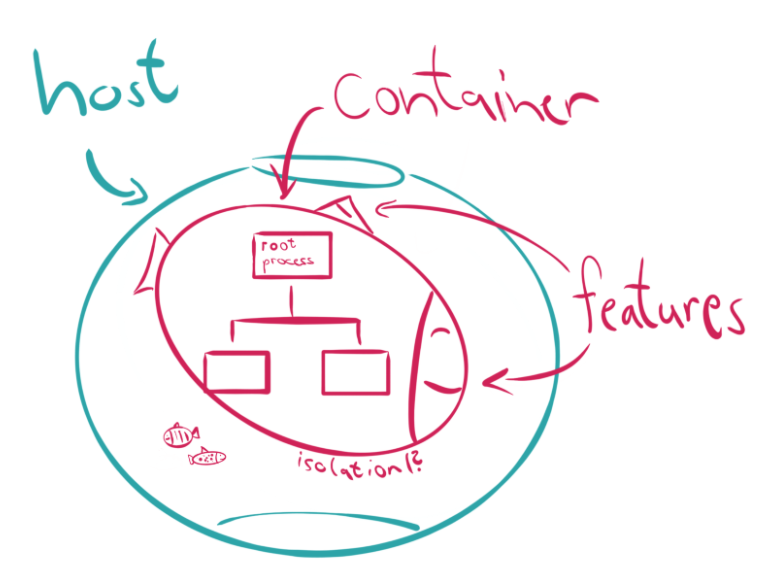
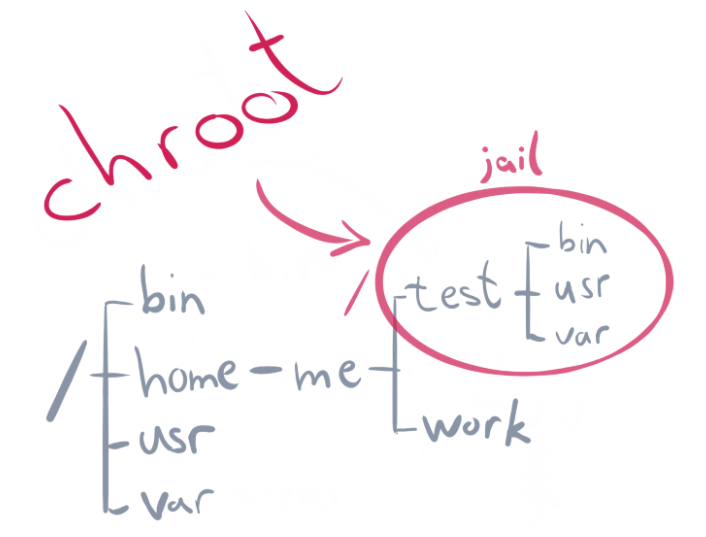

# Docker basic

## What is the Container?
Simply put, a `container` is simply `another process` on your machine that has been `isolated` from all other processes on the host machine

## What is the Container Image?
When running a container, it uses an `isolated filesystem`. This custom filesystem is provided by a container image. Since the `image contains the container's filesystem`, it must `contain everything needed to run an application` - all dependencies, configuration, scripts, binaries, etc. The image also contains other configuration for the container, such as environment variables, a default command to run, and other metadata.

## Chroot
A `chroot` on Unix operating systems is an operation that `changes the apparent root directory` for the `current running process` and its children. This Jailing

The programs that run in `this modified environment` `cannot` access the files `outside` the designated directory tree. This essentially limits their access to a directory tree and thus they get the name `chroot jail`.

See more [Chroot & Chroot Jail](https://www.geeksforgeeks.org/linux-virtualization-using-chroot-jail/) on Linux

[Demystifying Containers Series Github](https://github.com/saschagrunert/demystifying-containers)

## Docker differs from Virtual Machine (VM)
- Docker is `container based` technology while VM `is not`
- In Docker, the container is running in an `isolated process` from the rest of the host while with VM, server hardware is `virtualized` & VM `shares hardware resource` from the host.
- Use Docker to `isolate individual applications`, use Virtual Machines to `isolate entire systems`.
- `Docker containers` are typically much `smaller` and `faster` and that fits to `microservices`
- `VMs` are created and managed as plain machines that `never get replaced` or do not change very often.

See how the Docker installed on WinOS (my machine) [`here`](https://github.com/lqtruong/kafka-docker)

See how the `MongoDB` installed on Docker container using `Replicaset` mode [`here`](https://github.com/lqtruong/mongo-replset)