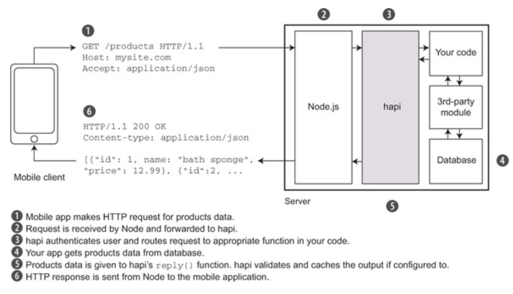
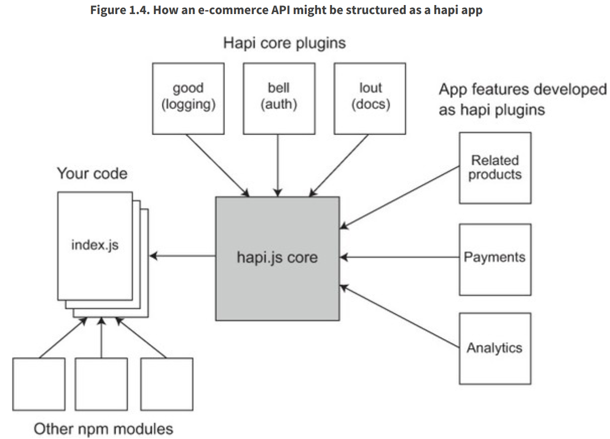
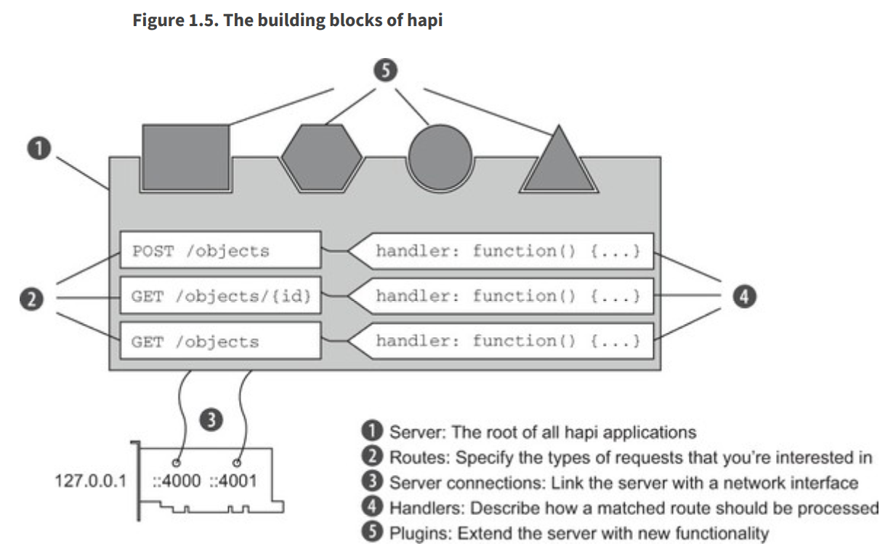

# HAPI overview
[`HAPI`](https://hapi.dev/) stands for `HTTP API` is a Node.js `web framework`. It helps to Build `powerful`, `scalable` applications, with `minimal overhead` and `full out-of-the-box functionality`.

Similar web frameworks
- [Express.js](https://expressjs.com/) - A Fast, nopinionated, minimalist web framework for Node.js
- [restify](http://restify.com/), [Github](https://github.com/restify/node-restify) - A Node.js `web service framework` optimized for building semantically correct RESTful web services ready for production use at scale
- [Koa](https://github.com/koajs/koa) - Koa is a `new` web framework designed by the `team behind Express`, which aims to be a smaller, more expressive, and more robust foundation for web applications and APIs.

Other Node.js best framework
- [Meteor.js](https://github.com/meteor/meteor) - open source framework for seamlessly building and deploying Web, Mobile, and Desktop applications in `Javascript`.
- [socket.io](https://github.com/socketio/socket.io)
- [Nestjs](https://github.com/nestjs/nest) - A `progressive` Node.js framework for building efficient, reliable and scalable server-side applications.
- [Sail.js](https://sailsjs.com/) - The `MVC` framework for Node.js
- [Total.js](https://www.totaljs.com/) Platform offers you an excellent and `stable server-side` Node.js framework, `client-side` library for creating famous web applications with more than 230 UI components for free.
- [Feather.js](https://feathersjs.com/) A framework for `real-time` applications and REST APIs
- [LoopBack 4](https://loopback.io/) A highly extensible Node.js and `TypeScript framework` for building APIs and microservices.
- [Adonis.js](https://adonisjs.com/) Writing micro-services or if you are a fan of `TDD`, it all boils down to confidence. AdonisJs simplicity will make you feel confident about your code.
- [Derby.js](https://www.derbyjs.com/) DerbyJS is a full-stack framework for writing modern web applications.

So, why do we use HAPI ? => ```The Simple, Secure Framework```. When using HAPI, we `just focus` on writing the `business logic`.

- hapi as an `API server`
- hapi as a `website server`
- hapi as a `HTTP proxy`

```
hapi sits between Node and your own application’s code, providing an abstraction layer for working with HTTP requests and responses.
```


## What makes it special?
- `modularity` is perhaps the `greatest strength` of `hapi`
- `Configuration-driven` features
- It's `really quick` to get started
- It's `open source`
- It's been battle-`tested in production`
- `Opinionated` frameworks 

Compared to `Express.js` framework: Express `doesn't offer` its own solution for `organizing code`, `input validation`, or `working with databases`.

- `Modular`, `plugin-based` architecture



- `configuration-­centric`: writing configuration is better than writing code

Building blocks of hapi



In the example & exercise, we use those following libs & versions

- node.js v14.16.1
- npm v6.14.12
- @hapi/hapi@20.1.2

## To create a simple hapi API server
We can use below code to start an API server
```
const server = Hapi.server({
        port: 4000,
        host: 'localhost'
    });
// do other routing
await server.start();
```

See more [hapi_server.js](../../hapi_server.js) for Hello World example using hapi v20.1.2

## When to use hapi?
- `JSON APIs`
- `Static or database-driven` websites
    - @hapi/inert for Static file and directory handlers for hapi.js.
- `Single-page` applications
- `Proxies`

## When NOT to use hapi?
- NOT a right choice for `CPU­ intensive` applications such as video encoders, AI software, or 3D­rendering applications
- NOT be recommended for `hard real­time applications` like  vionics, nuclear power, or high­frequency financial trading systems...
    - @hapi/nes: WebSocket adapter plugin for hapi routes.

# hapi plugins
- Express Migration
- Authentication
- Caching
- Cookies
- Logging
    - @hapi/good
    - @hapi/good-console
- [Plugins](https://hapi.dev/plugins/)
    - Register a plugin ```server.register(plugins, [options], [callback])```
- Routing
    - @hapi/nes
- Server Methods
- Serving Static Files
    - @hapi/inert
- Testing
- Validation
- Views

# hapi issues
- https://github.com/hapijs/hapi/issues
