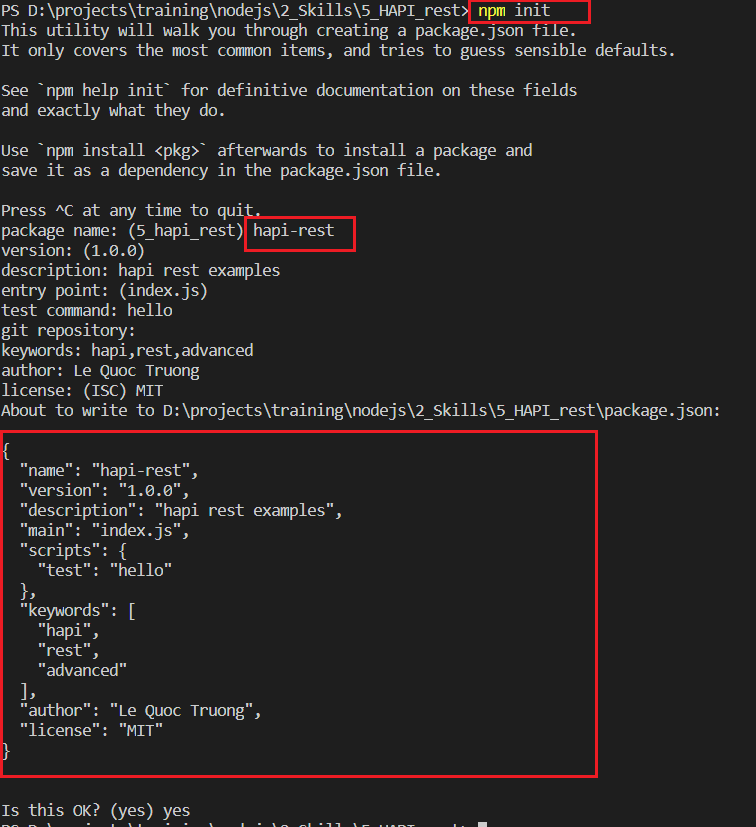
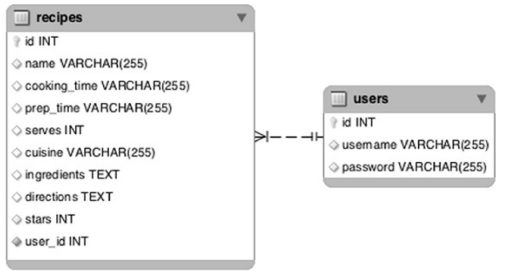

# HAPI rest
In this section, we would go further a bit to create design a `HTTP API application` using `hapi`. Chapter 2

- `Section 2.3` talks about how to write `REST api`, `database` connect & `routes` with `handlers`
- `Section 2.4` talks about `modularization` principles with Node.js
    - do not keep all codes in `index.js`
    - organize codes in to smaller module/or package following `SRP`
    - use technique `small surface area`
    - use ```await server.register(plugins, [options])``` to register a plugin to a server. This maybe replace the `bind()` from older version`?`
    - move `router` & `handler` into separate modules
- `Section 2.5` talks authentication
    - schemes and strategies
        - A `scheme` is a general `type of authentication`. For instance HTTP Basic  authentication and HTTP Digest authentication
        - A `strategy` is a `configured instance of a scheme` with an assigned name

Approach is below steps
- analyze requirements & produce clear user stories
- prepare working directory of project
- install @hapi/hapi the latest version (see version we for the example at [Overview section](../4_HAPI_overview/README.md), the version has some significant changes in its [api specifications](https://hapi.dev/api/?v=20.1.2) & [documentations](https://hapi.dev/tutorials/?lang=en_US)
- prepare a database and sample data
- prepare server routes

We would not go through the requirement analyzing step for brevety. Now we go to the working directory preparation

Let's get started

- prepare working directory of project

We create a directory named `dindin` for the starup project, the we create a module/`package`, we use ```npm init``` and input the information to generate the root `package.json` file



- prepare a database and sample data

We use `sqlite3` as the database for light & quick setup. Assume we have the `users` & `recipes` tables



- prepare server routes
The hapi `server routes` has the options that has many configuration properties as described at the link [Server router routes](https://hapi.dev/api/?v=20.1.2#-serverrouteroute)

```server.route(options);```

`options`
- `path` (required): the absolute path used to match incoming requests (must begin with '/').
- `method` (required): Typically one of 'GET', 'POST', 'PUT', 'PATCH', 'DELETE', or 'OPTIONS'.
- `vhost` (optional): a `domain string` or an array of domain strings for limiting the route to only requests with a matching host header field. (maybe for `redirecting`?)
- `handler`: taking request & reply the data to client
- `options` (optional): additional route options
- `rules` (optional): route custom rules object

In the example, we design `2 routes` as `paths` below

- /GET `'/api/recipes'` <=> `viewAllRecipes`
- /GET `'/api/recipes/{id}'` <=> `viewRecipeById`


## Authorization
We use `server.register()` to register the authorization plugin for validate the request. For instance, the plugin `hapi-­auth-­bearer-­token` for `hapi authorization` using `bear authorization` type

- use @hapi/boom for HTTP-friendly error objects.
- use @hapi/basic for HTTP basic authentication strategy
- use @hapi/hapi-auth-jwt2 for JSON Web Token Header authorization
