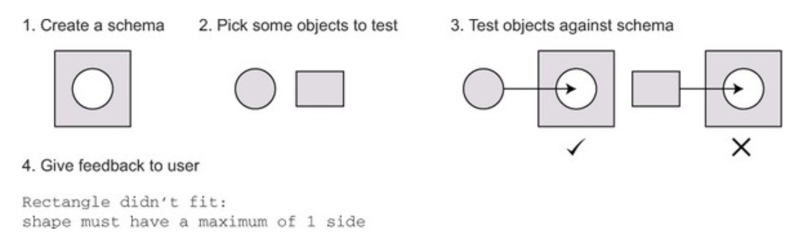

# HAPI JOI Validation

`@hapi/joi` plugin helps to `validate the hapi request` before processing further.

Steps taken with `Joi`

`Fluent interfaces`: are an approach to API design in software development. They're also commonly known as `chainable interfaces` because they consist of methods that are `chained onto one another`.

`Joi schemas` are also built using a `fluent interface`

See more [hapi_joi.js](../../hapi_joi.js)

## Joi.assert() vs. Joi.validate()

- `Joi.assert()` is useful for cases where you want to stop executing the current call stack if the validation check fails

See more [hapi_joi_validate.js](../../hapi_joi_validate.js)

We can use `abortEarly` option to stop the program early

See more [hapi_joi_validate_req.js](../../hapi_joi_validate_req.js) for request vaidation

See more [hapi_joi_validate_res.js](../../hapi_joi_validate_res.js) for response data validation

## Customizing the validation response with failAction

We can use `failAction` options to `customize the error` validation response

See more [hapi_joi_validate_req_error.js](../../hapi_joi_validate_req_error.js) for custom error validation

See more the [joi documentation v17.4.0](https://joi.dev/api/?v=17.4.0)