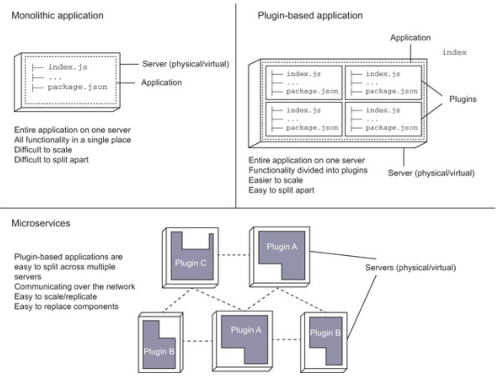
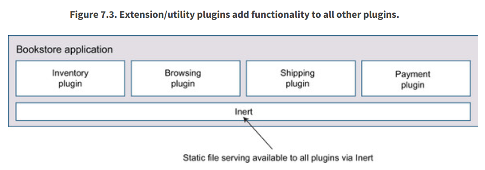

# Modularity with plugins

- When `building software`, we strive for `modularity` at many different layers.
- We package `reusable statements into functions` and `functions into modules and classes`
- The `hapi plugin` system exists to `give you a way` to achieve `modularity` in how you build servers
- Node.js building plugins to `smaller packages` and `share` them with each others via `private npm repository` 



To load a plugin, use `server.register()` 
- Plugins can contain routes, server methods, extension points, custom handlers, and decorators.
- 2 types of plugins
    - business logic
        - kept private to your organization or team
        - plugins are always in total isolation
    - utilities
        - This kind implements something on a scale global to an application



For hapi application, normally we can modularize it into
- Routes
- Server methods
- Extension points
- Decorations

To write an `internal plugin`, just write the `register` function as below

```
'use strict';

const myPlugin = {
    name: 'myPlugin',
    version: '1.0.0',
    register: async function (server, options) { // this is to register a function of plugin

        // Create a route for example

        server.route({
            method: 'GET',
            path: '/test',
            handler: function (request, h) {

                return 'hello, world';
            }
        });

        // etc ...
        await someAsyncMethods();
    }
};
```
For `external plugin`, we need an extra `pkg` property

```
'use strict';

exports.plugin = {
    pkg: require('./package.json'), // for external plugin
    register: async function (server, options) {

        // Create a route for example

        server.route({
            method: 'GET',
            path: '/test',
            handler: function (request, h) {

                return 'hello, world';
            }
        });

        // etc...
        await someAsyncMethods();
    }
};
```
We can use [`server.dependency()`](https://hapi.dev/api/?v=20.1.2#-serverdependencydependencies-after) to define the dependent plugins inside another plugins.

```
const after = function (server) {

    // Additional plugin registration logic
};

exports.plugin = {
    name: 'example',
    register: function (server, options) {

        server.dependency('yar', after);
    }
};
```

Or 

```
exports.plugin = {
    name: 'test',
    version: '1.0.0',
    dependencies: {
        yar: '1.x.x'
    },
    register: function (server, options) { }
};
```

## To reduce boilerplate codes

Using `@hapi/glue` to reduce repetitive boilerplate code.
Using `Confidence` to get Smart configuration. For dynamic & declarative configurations


# Conclusion

- Plugins are like miniature `hapi.js` apps. You can combine them into an application.
- You can do all sorts of things in a plugin, including add routes, server methods, and
extension points and much more.
- You should try to `split your application entirely into plugins`, with the root level of your application purely defining configuration and loading those plugins into a server.
- You can configure plugins by setting options when you load them with `server.register()`.
- Plugins should be indifferent to the order they're loaded. For this reason you should
declare any dependencies within plugins using `server.dependency()`.
- You can use `Glue` to simplify composing application from plugins using a manifest.
- You can make `smart manifests` with `Confidence`.
- There are several methods for communicating into, out of, and horizontally across
plugins, including server configuration, `server.expose()`, and using `EventEmitters`.

