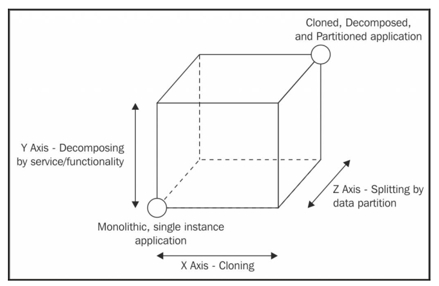

# Scaling Node applications 

Chapter 10 - Node.js Design Paterns, 2nd Edition

- What the `scale cube` is
- `How to scale` by running multiple instances of the same application
- How to `leverage a load balancer` when scaling an application
- What a `service registry` is and how it can be used
- How to `design a microservice architecture` out of a monolithic application
- How to `integrate a large number of services` through the use of some simple architectural patterns

## Scale cube

Recap
- Node.js provides non-blocking I/O paradigm
- support concurrent requests with single thread

Three dimensions of a scale cube
- x-axis: `Cloning`
    - cloning the same application `n times` and letting each instance handle `1/nth` of the workload
- y-axis: `Decomposing` by service/functionality
    - decomposing the application based on its functionalities, services, or use cases. Like administration UI from the public-facing product UI
    - microservices architecture
- z-axis: Splitting by `data partition`
    - the application is split in such a way that `each instance is responsible for only a portion of the whole data`
    - related to database such as `horizontal partition`, or `sharding`




Node.js applications
- to `distribute the load` of an application across `different instances` running on `a single machine`, Node.js uses the `cluster module` of the core itself.
- the cluster module `shares the same server socket` across the workers and leaves to the operating system
- the algorithms used by the `operating system to distribute the load` across the workers `are not meant` to load-balance network requests, but rather to `schedule the execution` of processes
- use Round Robin load balancing algorithm

Benchmark the http request, we use `siege` tool. See more [siege_benchmark.js](siege_benchmark.js)

```
const siege = require('siege')

siege()
    .on(8080)
    .for(10000).times
    .get('/')
    .attack()
```


Now, we make a simple program using `cluster of core node`. See more [node_cluster.js](node_cluster.js)

```
const cluster = require('cluster');
const os = require('os');
if (cluster.isMaster) {
    const cpus = os.cpus().length;
    console.log(`Clustering to ${cpus} CPUs`);
    for (let i = 0; i < cpus; i++) {
        cluster.fork();
    }
} else {
    require('./app');
}
```


We can see that the number of `request per seconds` (e.g. `rps`) increased from `313` to `927`, and the `response time` is also reduced a lot

Using cluster module, the processes are distributed across CPUs
```
PS D:\path> node .\node_cluster.js
Clustering to 8 CPUs
Started 2544
Started 17732
Started 15256
Started 2520
Started 10908
Started 25548
Started 15320
Started 20768
```

[`pm2`](https://github.com/Unitech/pm2) is a module that offers `load balancing`, `process monitoring`, `zero-downtime restarts`, and other goodies.

- The `cluster module` does `not work well with stateful` communications.
- we can use `Redis` to share the state across multiple instances
- we can use `sticky-session` lib along with `load balancer` to share the state and keep the `stateful` communications. But `recommendation is to avoid` sticky-session & stateful communications. Instead of that, we build application that maintains the `session state in a shared store`.

Alternatives to use `reverse proxy for load balancing`

- `Nginx` (http://nginx.org): This is a web server, reverse proxy, and load balancer, built upon the non-blocking I/O model.
- `HAProxy` (http://www.haproxy.org): This is a fast load balancer for TCP/HTTP traffic.
- `Node.js-based proxies`: There are many solutions for the implementation of reverse proxies and load balancers directly in Node.js. This might have advantages and disadvantages, as we will see later.
- `Cloud-based proxies`: In the era of cloud computing, it's not rare to utilize a load balancer as-a-service. This can be convenient because it requires minimal maintenance, it's usually highly scalable, and sometimes it can support dynamic configurations to enable on-demand scalability.

Practical

- Use `Consul as a service registry`. Download & start `consul` (WinOS: `consul.exe agent -dev`)
- `peer-to-peer load balancing` is used to `avoid reverse proxy` where is neccessary to expose the `single access point`. And provides also below benefits
    - `Reduces the infrastructure complexity` by removing a network node 
    - Allows `faster communications`, because messages will travel through one fewer node 
    - `Scales better`, because performances are not limited by what the load balancer can handle
    - use `ZeroMQ` to implement `peer-to-peer load balancing`

With `peer-to-peer load balancing`, the `client can easily implement the load balance` algorithm without constraints

See more [simple load balancer](simple_balancer/simple_balancer.js) without reverse proxy, [client](simple_balancer/client.js) client load balancing

Microservices also face some nontrivial challenges: such as data owner


