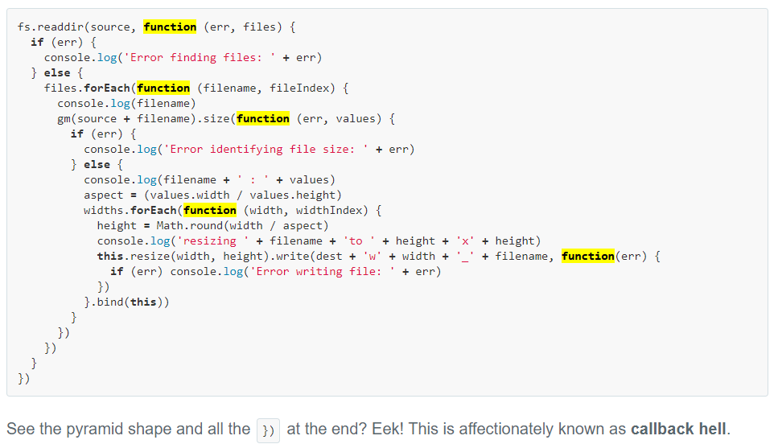

# [Callback Hell](http://callbackhell.com/)

The cause of callback hell is when people try to write JavaScript in a way where execution happens visually from top to bottom. Lots of people make this mistake! In other languages like C, Ruby or Python there is the expectation that whatever happens on line 1 will finish before the code on line 2 starts running and so on down the file. As you will learn, JavaScript is different.



OR simply understood as ```Nested callbacks with across scope side-affects``` that is hard to understand and control.

See more at http://callbackhell.com/